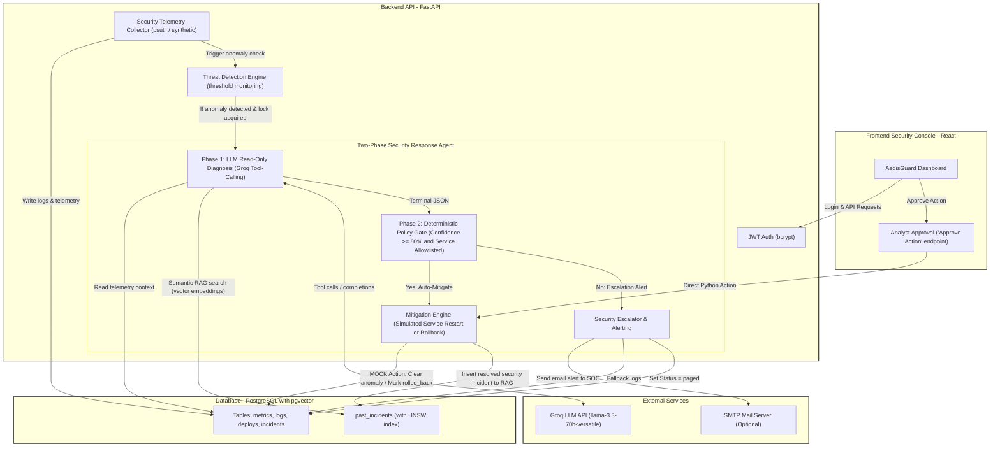

# AegisGuard — Autonomous Security Monitoring & Threat Investigation Agent

AegisGuard is an autonomous cybersecurity incident response and threat investigation architectural prototype. It demonstrates a **two-phase safety architecture** designed to leverage large language models (LLMs) for system security telemetry monitoring and threat diagnosis while keeping action execution bound within a deterministic policy engine.

Under anomalous conditions (e.g., suspicious traffic, brute force spikes, or egress anomalies), AegisGuard executes a read-only agent loop (Phase 1) using Groq API model instances to isolate the threat. It then hands off its structured findings to a deterministic Python policy engine (Phase 2) for automated mitigation (such as simulated service restarts or rollbacks) or human analyst escalation (via SMTP or fallback logs).

## Architecture 

AegisGuard operates via a four-stage pipeline:



### 1. Threat Detection (Engine)
A background engine monitors telemetry metrics (e.g., latency, error rates, host CPU). If latency exceeds 500ms, error rates exceed 5%, or host CPU exceeds 85%, a service lock (`Service.investigation_in_progress`) is acquired to block concurrent runs.

### 2. Autonomous Investigation (Phase 1)
The agent executes an LLM tool-calling loop. The model has read-only access to:
* `get_metrics(service)`: Analyzes recent performance trends.
* `get_logs(service)`: Scans for error traces or security warnings.
* `get_recent_deploys(service)`: Checks for recent code modifications.
* `search_similar_incidents(query_text)`: RAG vector search to find similar historical threat scenarios.

### 3. Policy Gate (Phase 2)
The LLM outputs a structured hypothesis, confidence, and recommended action. A separate Python policy gate evaluates this recommendation. Auto-mitigation is allowed ONLY if:
* The LLM confidence score is >= 80%.
* The affected service is present in the `ACTION_ALLOWLIST`.
* The service is not `local-host` (which is blocked by policy from restarts).

### 4. Action & Escalation
* **Auto-Mitigate**: If policy requirements are met, the engine executes the remediation (e.g., clearing the anomaly, rolling back simulated deployment) and stores the resolution in the database.
* **Escalation**: If checks fail, AegisGuard pages a human security engineer via email (or logs) and places the incident in `paged` status, awaiting manual authorization from the console dashboard.

---

## Tech Stack
- **Backend API**: FastAPI (Python 3.10), Uvicorn.
- **Database & ORM**: SQLAlchemy (Async), PostgreSQL with the `pgvector` extension and an HNSW cosine distance index.
- **Embeddings & RAG**: `sentence-transformers` (`all-MiniLM-L6-v2`) used locally to embed incident titles and root causes.
- **LLM Agent**: Groq SDK (OpenAI-compatible client calling Llama 3 models) executing a function-calling loop.
- **Frontend Console**: React (v19), Chart.js, Vanilla CSS.

---

## Why AegisGuard Matters

Traditional security monitoring systems generate alerts that overwhelm security operations center (SOC) analysts. AegisGuard addresses this by:
1. **Automating Threat Diagnostics**: Leveraging local Retrieval-Augmented Generation (RAG) to cross-reference active symptoms with historical security incident records.
2. **Deterministic Guardrails**: Ensuring that the AI agent *never* has direct write access to infrastructure. Remediations are strictly gated behind hardcoded policy checks.
3. **Optimizing Human-in-the-Loop Operations**: Escalating complex or low-confidence threats to security engineers, presenting clear AI-generated diagnostic timelines and metric summaries for rapid review and authorization.

---

## How to Run

### Prerequisite: Database Setup
Ensure a PostgreSQL database instance is running with `pgvector` enabled. 

In Docker environments, this is handled automatically. For Windows local users, a helper script is provided at [`install_pgvector.ps1`](file:///c:/Users/navee/OneDrive/Desktop/Vigil/install_pgvector.ps1) to copy extension binaries to local PostgreSQL installation paths.

### Option 1: Running Locally (Backend & Frontend)

1. **Setup Backend**:
   Install requirements:
   ```bash
   pip install -r requirements.txt
   ```
   Start the FastAPI development server:
   ```bash
   python main.py
   ```
   *Note: This automatically prepares the database schema, runs database seeding (adding 13 historical incident records, including cybersecurity scenarios, with embeddings), starts the telemetry loop scheduler, and launches the server.*

2. **Setup Frontend**:
   Navigate to the frontend folder, install dependencies, and run:
   ```bash
   cd frontend
   npm install --legacy-peer-deps
   npm start
   ```
   *The React console will open at `http://localhost:3000`.*

3. **Verify Installation**:
   Verify endpoints are running by executing the smoke test script:
   ```bash
   python smoke_test.py
   ```

### Option 2: Running via Docker Compose
To run the database, FastAPI backend API, and React console fully containerized:
```bash
docker-compose up --build
```
- FastAPI Swagger: `http://localhost:8000/docs`
- React Console: `http://localhost:3000`

---

## Safety Design Rationale
The primary architectural goal of AegisGuard is the **strict separation of probabilistic reasoning from deterministic action execution**:
1. **Phase 1: LLM Investigation (Read-Only)**: The LLM is given access to strictly read-only diagnostics (`get_metrics`, `get_logs`, `get_recent_deploys`, `search_similar_incidents`). It *physically cannot* perform write actions.
2. **Phase 2: Safety Policy Gate (Deterministic)**: The LLM completes Phase 1 by returning a structured JSON containing a confidence score and recommendation. A standard Python module, completely isolated from the LLM context, evaluates this recommendation. The engine executes automated actions *only* if:
   - The LLM confidence score is >= 80%.
   - The affected service is present in the `ACTION_ALLOWLIST`.
   - The service is not `local-host` (which is blocked by policy from restarts).
3. **Operator Control**: Any investigation failing the safety checks is escalated to an SRE/SOC analyst. The analyst reviews the LLM's diagnostic reasoning and can manually trigger the action via a dashboard request that completely bypasses the LLM.

---

## Known Limitations & Architecture Notes
As an architectural prototype designed for demonstrating autonomous cybersecurity incident response patterns, AegisGuard contains the following intentional design simplifications:
* **Mocked Action Execution**: Remediation actions are simulated. Restarting a service simply clears the database anomaly status column. Rolling back a deployment updates a status column in the Postgres database. No actual cloud infrastructure or containers are modified.
* **SMTP Fallback**: Real email alerting requires configuring `SMTP_USER` and `SMTP_PASSWORD` in `.env`. When unconfigured, AegisGuard falls back to writing alert payloads to structured application logs to prevent silent alert drop.
* **Single Demo User**: Authentication uses a single hardcoded demo user (`admin` / `vigil2025`) for dashboard operations, rather than a full multi-tenant IAM database.
* **Synchronous Run Loop**: The background monitoring loop runs in the background of the FastAPI web process, making it simple to run in a single development session.
